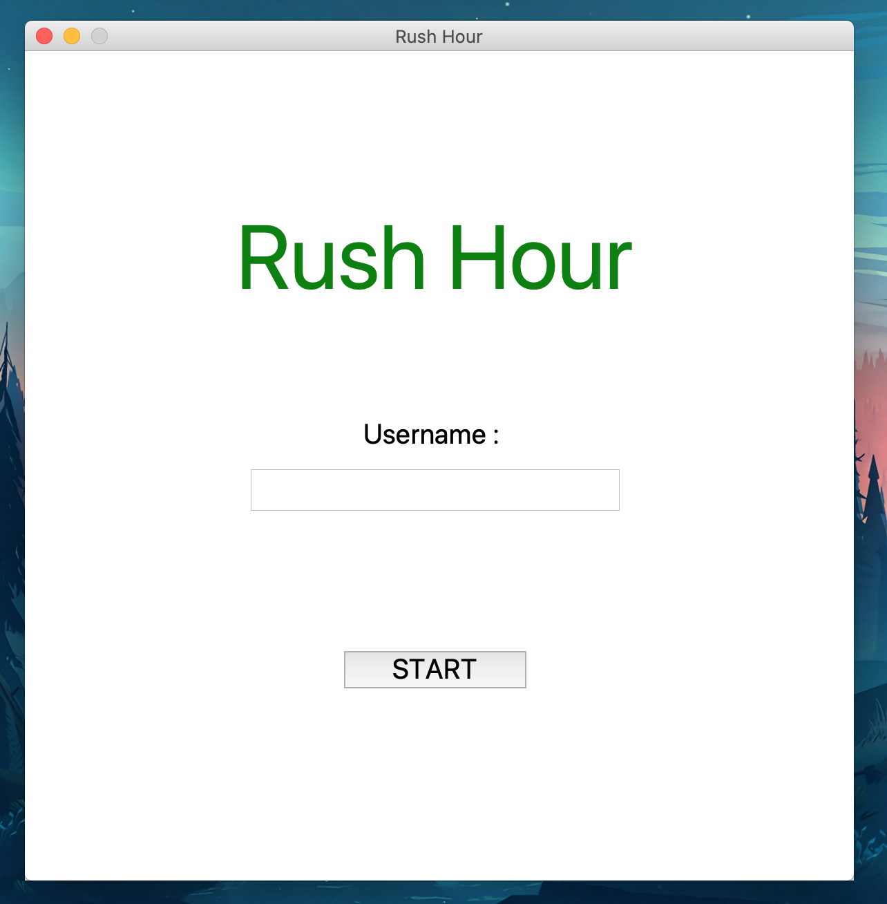
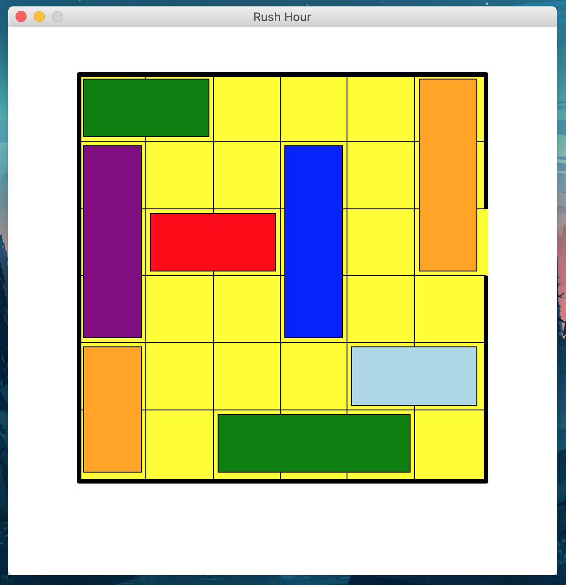
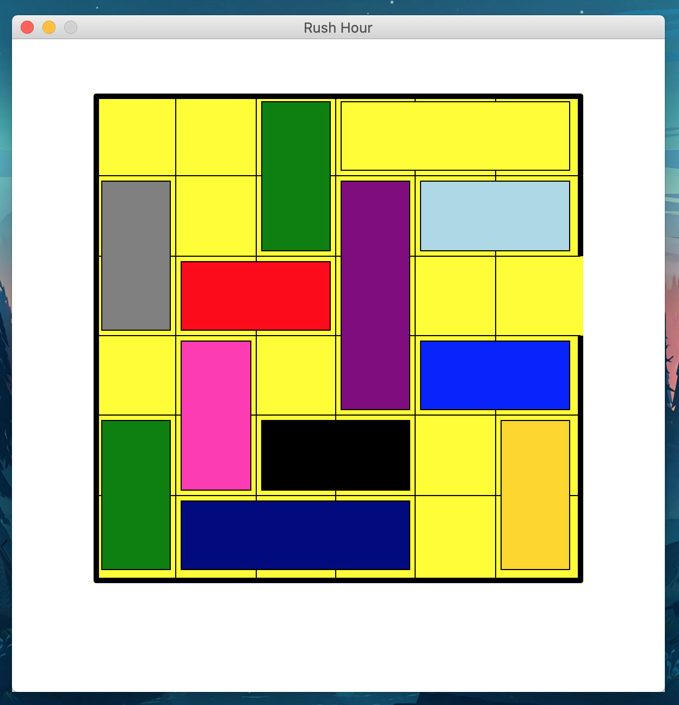

# Rush Hour Game

A Quickly made **Rush Hour 🚗** game in `python` to present the general idea and implementation of a `MVC` architecture. 

## Screen captures :

### Home 

### Lvl 1 

### Home 

## ToDo 
- [X] Basic MVC architecture setup
  - [X] **models** folder
    - [x] user
    - [X] block
  - [X] **controllers** folder
    - [x] level controller
    - [X] block controller
  - [X] **views** folder
    - [X] single modular block view 
    - [X] lvl 1 view
    - [X] lvl 2 view
    - [X] common 'won' view 

> total hours spent : ± 13h 